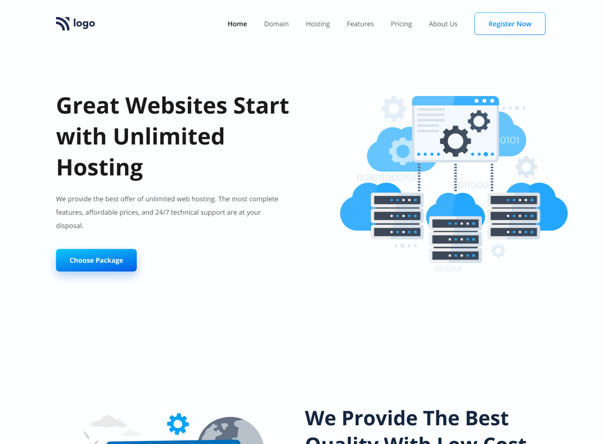
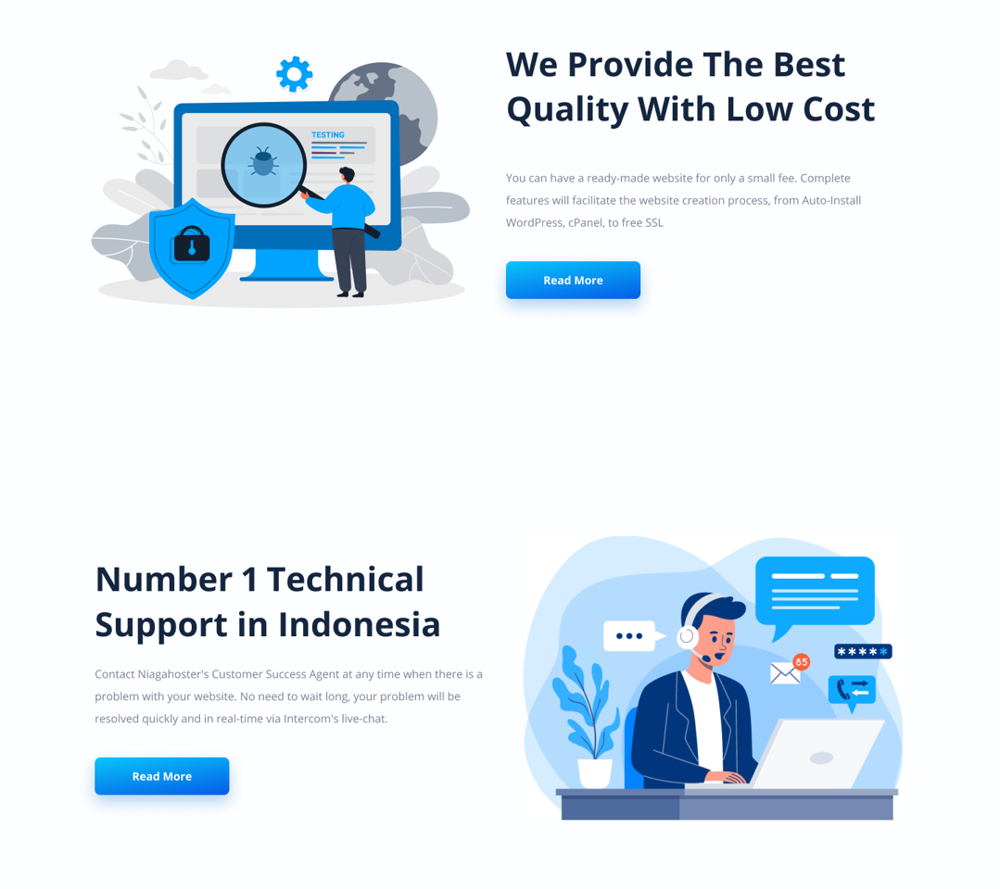
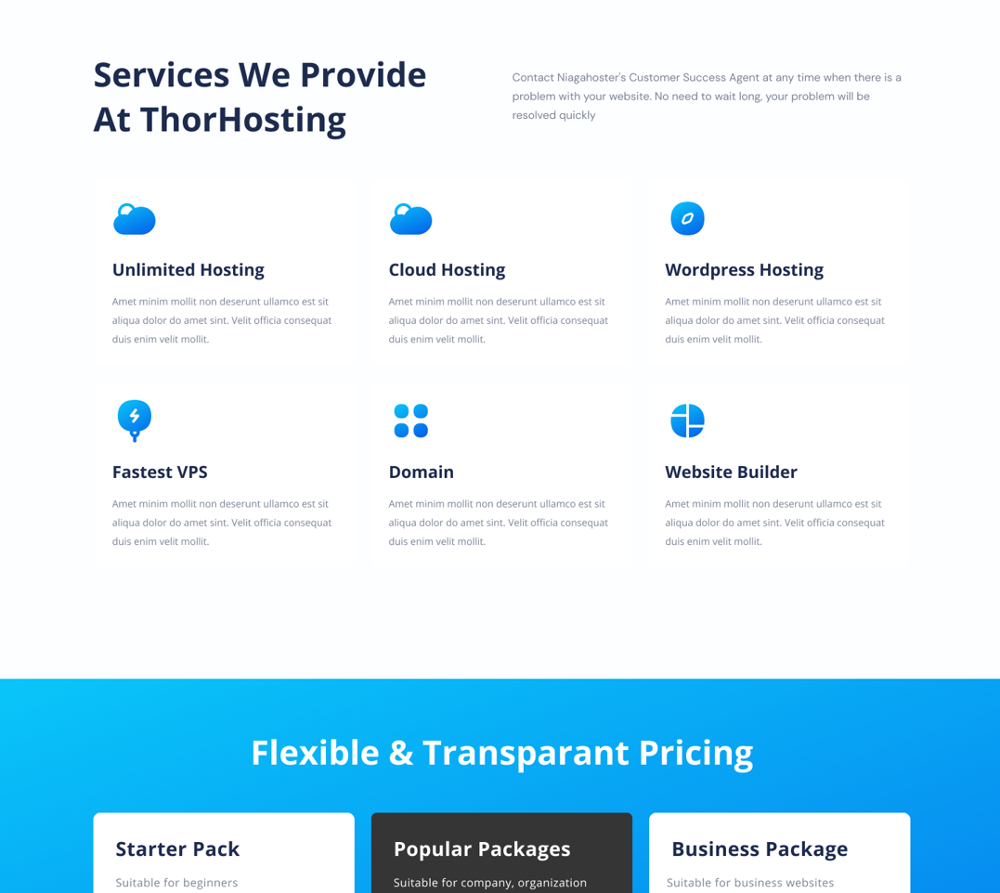
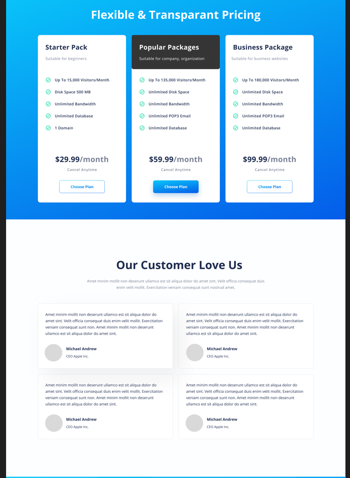
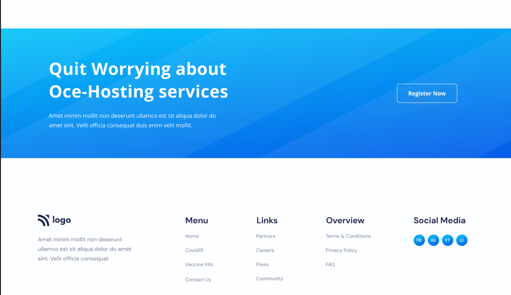

# HostingPro Company Landing Page 

### Project Thumbnails are shown below

***
### Project details
This project is a landing page of a company HostingPro. It is a purely responsive design , created for Desktop , mobile , and tablet usage. Only UI is developed for this project for this project, functionality is not .

***
### Other Important Details
- >Time taken for completion : 16 hours
- Technologies Used
  - HTML
  - CSS
- VSCode for coding
- Figma
- Personal Learnings in this project 
    - HTML
    - CSS 
- Deployed on *Netlify*  **[ClickMe]()** 
*** 
#### About Author

- ~ Pritam Pal ~
- Profession - Full Stack Developer
- Contact Email - pal.pritam1416131@gmail.com
- [Personal Website](#)
- [LinkedIn](https://www.linkedin.com/in/pritampal1/)  

